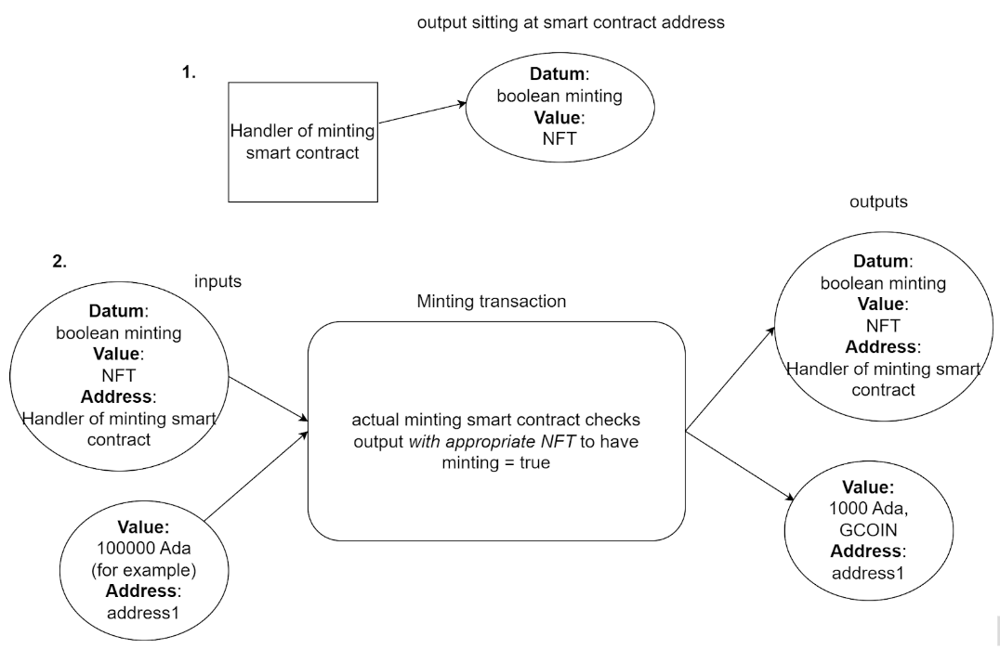

# Децентрализованное приложение в блокчейне Кардано для взаимодействия с GCOIN

## Description
Система позволяет "минтить" и "сжигать" GCOIN - цифровой финансовый актив, привязанный к индексу CO2.
Привязка токена к индексу CO2 не только создает возможность для финансовых инвестиций, но и подчеркивает важность борьбы с изменением климата и охраны окружающей среды. Ведь, если коэффицент CO2 растет в мире, то и стоимость токена растет вместе с ней.

Привязка к индексу имеет следующие цели:
 - Экологическая ответственность: подчеркивание важности сохранения природы 
 - Инвестиции в устойчивость: вкладывание средств в проекты и инициативы, направленные на уменьшение негативного воздействия на окружающую среду
 - Создание стабильных активов: GCOIN - это стейблкоин, который покупается/продается в пределах 98%-102% от индекса CO2
 - Социальное воздействие: может служить образцом для общества и предоставлять инсайты о том, какие усилия предпринимаются для борьбы с изменением климата. Это также может вдохновить людей принимать более экологические решения в повседневной жизни

Это средство, которое объединяет финансы и окружающую среду в стремлении к более устойчивому будущему.
### Functionality
 - "Минт" ЦФА (=покупка)
 - "Сжигание" ЦФА (=продажа)
 - Получение из API индекса CO2
 - Получение актуального значения индекса из скрипта(точнее говоря, из output'а скрипта засчет модели EUTxO блокчейна) 
 - Расчет налога, взымаемого блокчейном с транзакции
 - Подключение кошельков блокчейна Cardano: Nami, Eternl

### Parts of dapp
 - фронтенд часть (получение из API индекса CO2, взаимодействие со скриптами в блокчейне)
 - <a target="_blank" href="https://github.com/Timekiller7/cardano-dapp/blob/ccdf7be321ce231ebd4630bd0f85752c89028aa2/src/cardano/nft/onchain/HandlerContract.hs#L211"><b>скрипт пула, контролирующего рейт ЦФА к CO2 </b></a>
 - <a target="_blank" href="https://github.com/Timekiller7/cardano-dapp/blob/ccdf7be321ce231ebd4630bd0f85752c89028aa2/src/cardano/nft/onchain/HandlerContract.hs#L122C1-L122C14"><b>скрипт самого ЦФА, контролирующий его покупку и продажу</b></a>
 - <a target="_blank" href="https://github.com/Timekiller7/cardano-dapp/blob/ccdf7be321ce231ebd4630bd0f85752c89028aa2/src/cardano/nft/onchain/NFT.hs#L46"><b>скрипт для тред-токена, идентифицирующего output, в котором находится рейт </b></a>
 - обновление рейта в скрипте (происходит с бэкенда, в репозитории его нет)

Все функции, необходимые для взаимодействия с блокчейном, написаны с помощью библиотеки Lucid и находятся в файле <a target="_blank" href="https://github.com/Timekiller7/cardano-dapp/blob/main/src/cardano/nft/offchain.ts">offchain.ts</a>

### Scheme of minting transaction
</img>
В транзакции спендится два аутпута: один принадлежит скрипту (`mkHandlerValidator`),а другой - самого клиента, в котором хранится Ada, за которую можно купить ЦФА.
За счет того, что спендится аутпут скрипта, происходит валидация в `mkHandlerValidator` того, что рейт не изменен клиентом (чтобы последующие клиенты не могли по другому - сфальсифицированному рейту - покупать и продавать ЦФА.
Саму же покупку/продажу валидирует скрипт токена (`mkTokenPolicy`) - на off-chain происходит формирование транзакции с условием создания/сжигания ЦФА. Засчет этого условия в транзакции, скрипт токена исполняется.

Таким образом, `mkTokenPolicy` содержит следующие проверки транзакции:
 - При покупке клиент перечисляет в output `mkHandlerValidator` свои Ada, на которые хочет купить ЦФА
 - При продаже проверяется, что клиенту перечислилось пропорционально столько Ada, на сколько он сжег своих ЦФА

Инсталляция и запуск:
```
   npm install --force
   npm start
```


